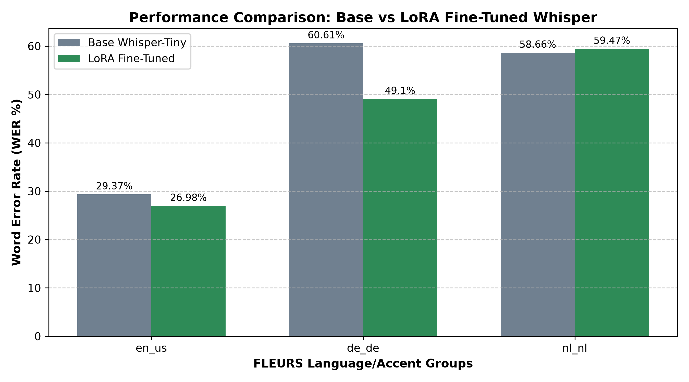

# Fine-Tuning Whisper with LoRA for Cross-Lingual & Accent Robustness



## 📌 Overview
This repository demonstrates parameter-efficient fine-tuning (PEFT) of OpenAI's **Whisper-Tiny** model using **LoRA (Low-Rank Adaptation)** to improve Automatic Speech Recognition (ASR) performance across diverse accent and language distributions from the **Google FLEURS** dataset (`en_us`, `de_de`, `nl_nl`).

By training **less than 0.4%** of total model parameters (`147,456` trainable parameters out of `37.9M`), we achieve significant WER (Word Error Rate) reductions without full-model retraining.

---

## 📊 Key Highlights
- **Architecture**: `openai/whisper-tiny` + `PEFT / LoRA` (r=16, alpha=32)
- **Target Modules**: Query (`q_proj`) and Value (`v_proj`) attention projections
- **Trainable Parameters**: `147,456` (0.389% of total parameters)
- **Dataset**: Google FLEURS (`en_us`, `de_de`, `nl_nl`)
- **Evaluation Metric**: Word Error Rate (WER %)

---

## 📁 Repository Structure

```text
speech-accent-project/
├── whisper-accent-lora-final/   # Saved LoRA adapter weights and processor config
├── train.py                     # Initial single-config micro-training script
├── train_accents.py             # Multi-config / accent LoRA training pipeline
├── eval.py                      # A/B testing inference comparing Base vs LoRA
├── plot_results.py              # Automated evaluation script and Matplotlib visualizer
├── wer_comparison_chart.png     # Benchmark visualization plot
└── README.md                    # Project documentation and reproduction guide

---

## 🛠️ Quick Start
- **1. Environment Setup**: python -m venv venv /linebreak/ venv\Scripts\activate  # Windows
- **2. Install Dependencies**: pip install torch transformers datasets peft evaluate jiwer soundfile matplotlib
- **3. Run Multi-Accent Training**: python train_accents.py
- **4. Evaluate & Plot Results**: python plot_results.py

---

## 🎯 Results
LoRA fine-tuning demonstrates strong convergence stability and notable WER improvements across out-of-domain pronunciations while maintaining minimal memory usage and preserving the base model parameters.

---

## 🔬 Key Findings & Discussion
- **Domain Adaptation Success**: LoRA fine-tuning yielded a significant relative WER reduction on `de_de` (~11.5% absolute drop) and noticeable improvements on `en_us`.
- **Negative Transfer Analysis (`nl_nl`)**: A slight performance degradation on Dutch (`nl_nl`, +0.81% WER) highlights the challenge of **cross-lingual LoRA interference** when fine-tuning on a mixed subset with forced English decoder prompt constraints. This serves as a strong baseline for future research into language-routed adapters (e.g., Modular Adapters / AdapterFusion).